# Matcha

Matcha est une application de rencontres en temps réel, développée en fullstack avec **React**, **Node.js**, **PostgreSQL** et **WebSocket natif**.

---

## À propos

Ce projet a été développé à deux en collaboration avec [Arthur](https://github.com/arlamber) et moi-même.


Elle intègre un système de messagerie instantanée, de notifications temps réel, une logique de célébrité (fame), ainsi qu'une interface responsive pensée pour mobile.

---

## Aperçu de l'application

### Page d’accueil

*Écran d’accueil de l’application avec accès direct à la création de compte ou à la connexion.*

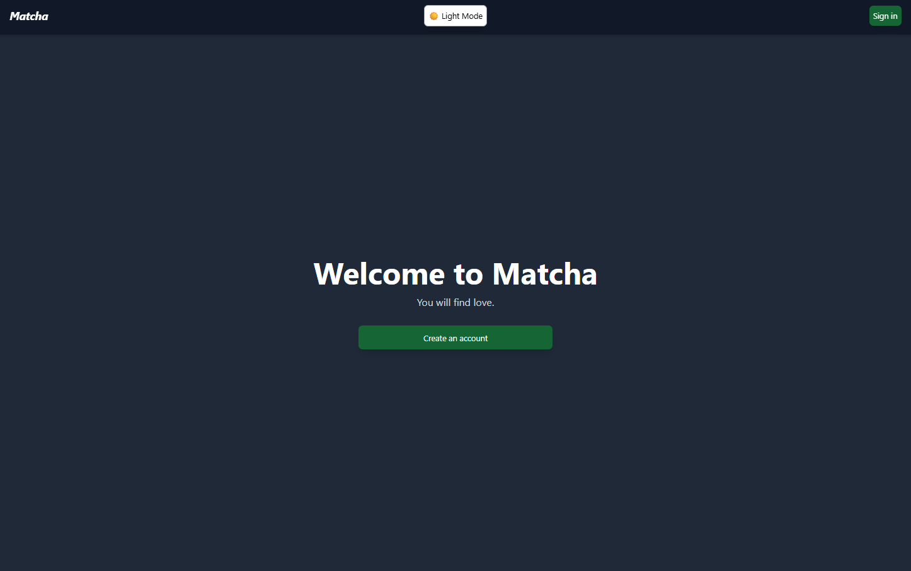

---

### Inscription

*Formulaire de création de compte avec nom, prénom, email et mot de passe.*

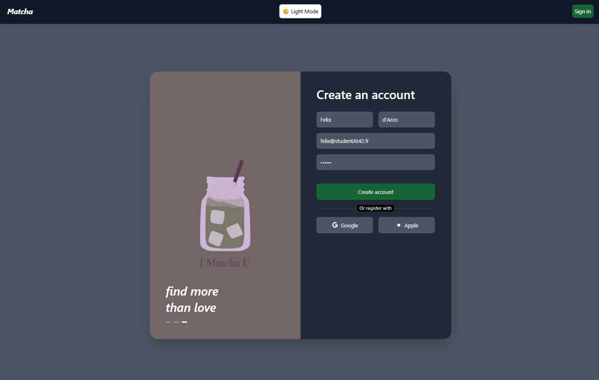

---

### Création de profil

*Complétion du profil utilisateur : photo, bio, passions, genre, orientation, et intentions (relation sérieuse, amitié, etc.). Plus le profil est complet, plus la “fame” augmente.*

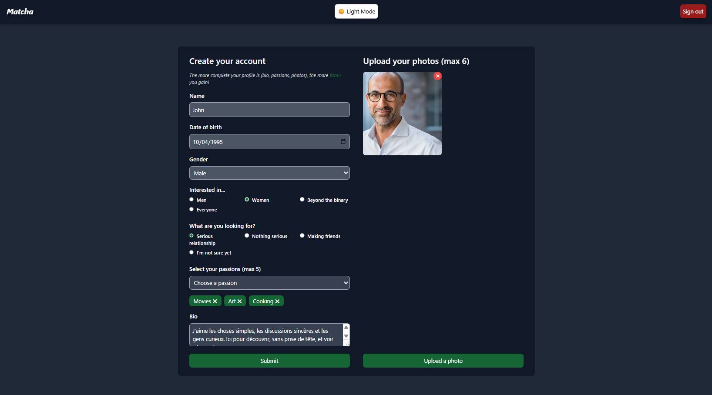

---

### Page de swipe

*Affichage des profils suggérés avec indication des passions communes, du niveau de célébrité, et possibilité de liker ou passer.*

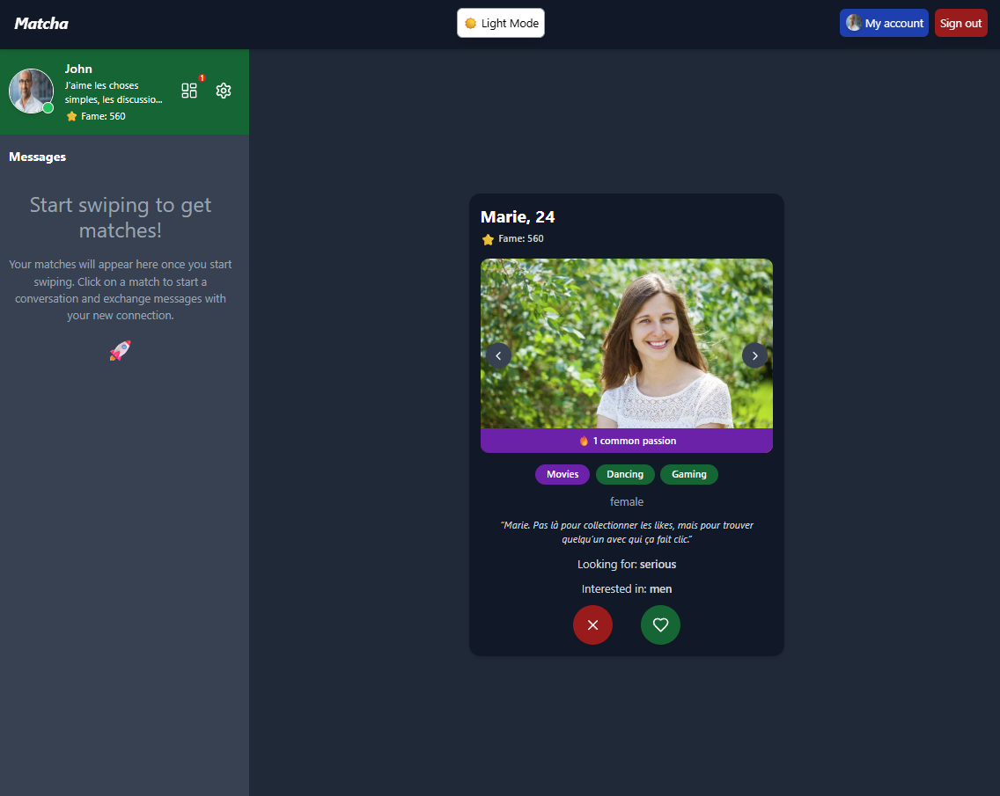

---

### Dashboard – Likes reçus

*Tableau de bord des interactions : vues, likes, matchs et messages. Ici, un utilisateur a liké mon profil.*

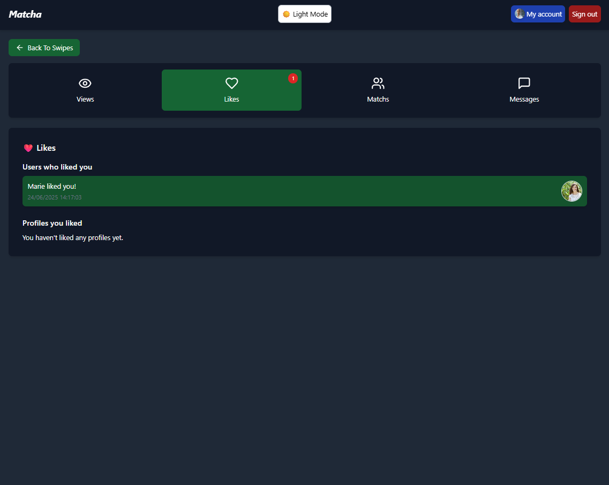

---

### Filtres de recherche

*Module de recherche avec filtres ajustables (âge, célébrité, distance, passions communes). Le nombre de profils correspondant est affiché en direct.*

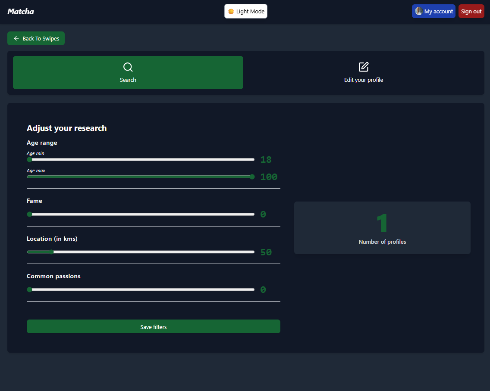

---

### Édition du profil

*Page permettant de modifier ses informations personnelles, passions et photos.*

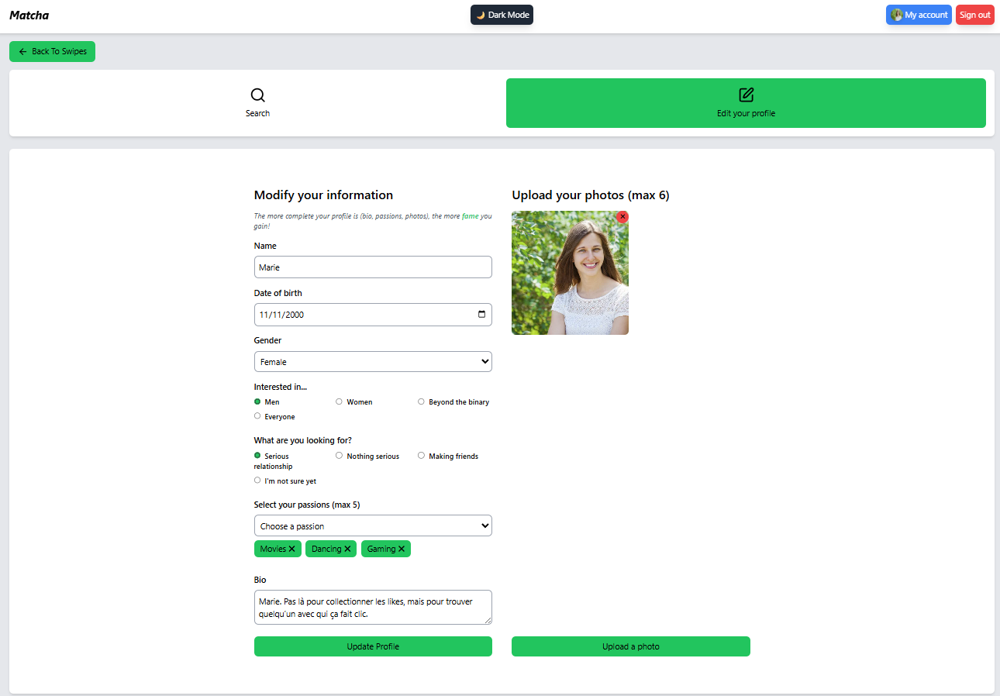

---

### Consultation de profil (modal)

*Affichage détaillé d’un profil avec toutes les informations : nom, âge, bio, passions, intentions, et bouton de signalement.*

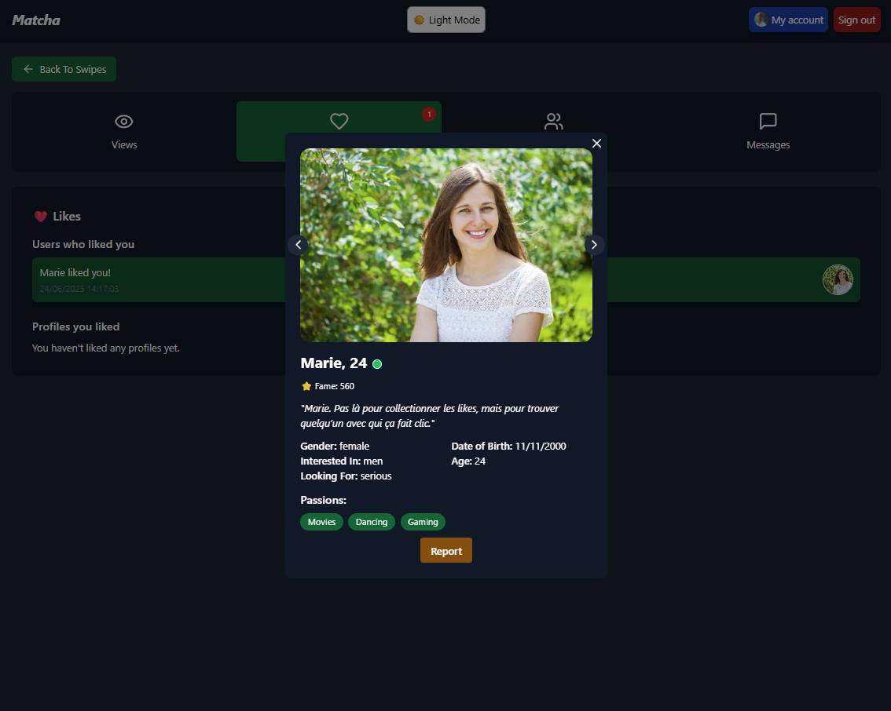

---

### Conversation en temps réel

*Échange de messages entre deux utilisateurs via WebSocket, avec affichage instantané côté expéditeur et destinataire.*

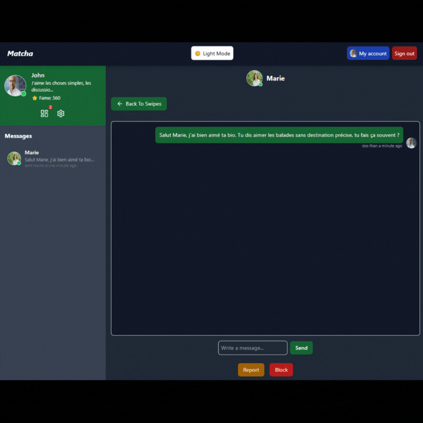

---

## Responsive – Vue mobile

*L'application est responsive pour une utilisation sur smartphone.*

<p align="center">
  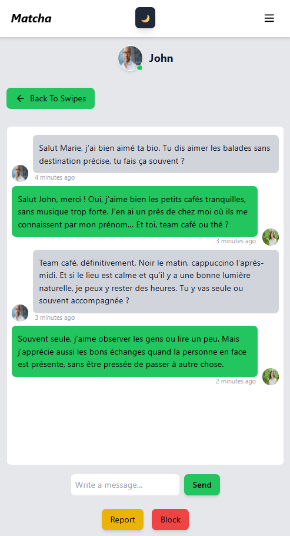
  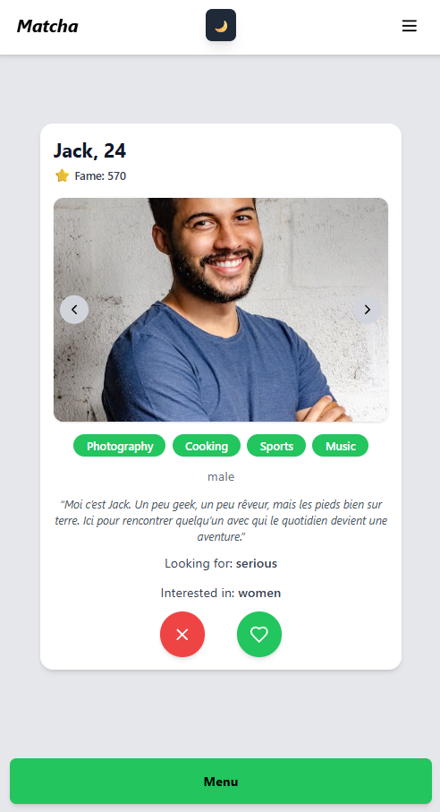
  
  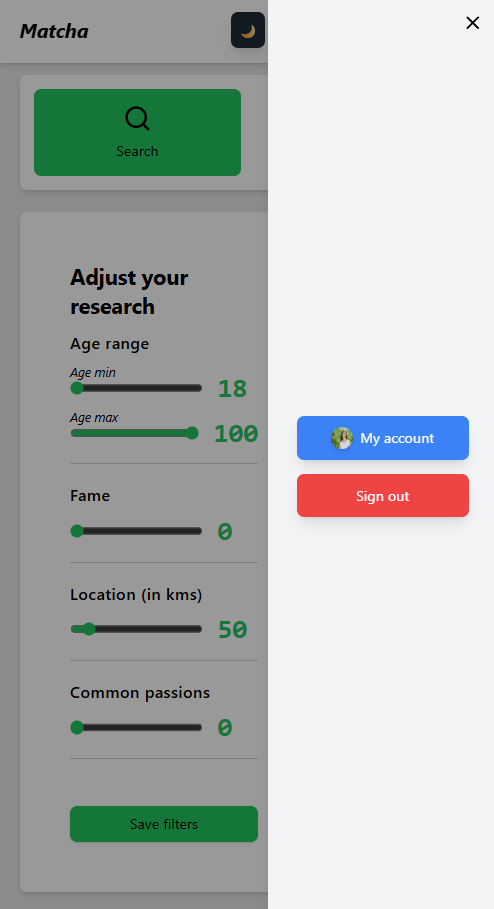
</p>


---

## Lancement du projet

Prérequis : **Docker** et **make** doivent être installés sur votre machine.

Quelques commandes utiles :

```bash
make up               # Démarre le projet
make re               # Nettoie tout et relance
make help             # Liste toutes les commandes disponibles
